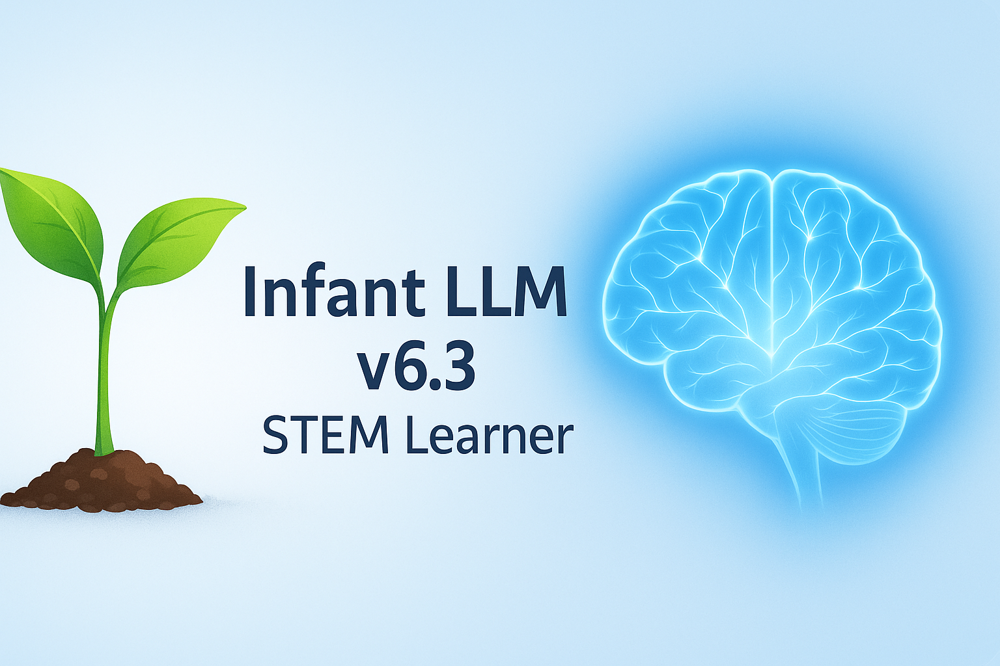

# Infant LLM v6.3 — STEM Learner

*A living AI experiment that grows through human teaching.*

This project provides a tiny, stage-based LLM that starts with almost no knowledge and **learns only from user input**. It supports **Auto** and **Manual** growth modes and includes a clean Flask Web UI.

## Features
- 🧠 **Stage-based growth**: Infant → Child → Teenager → Adult
- 🌱 **Auto growth** with realistic, slow maturity scaling
- ⚙️ **Manual stage control** (with baseline maturity)
- 🧾 **Memory store** with categories (general, math, science, engineering, technology, coding)
- ➗ **Math evaluation** at Teenager+
- 🌐 **Web UI**: fixed sidebar, chat bubbles, Enter-to-send
- ✨ **Stage-based shimmer effect** on new learning
- 💾 Session persistence (`session.json`), memory persistence (`memory.json`)

## Quick Start
```bash
# Create venv (recommended)
python3 -m venv infantenv
source infantenv/bin/activate    # Windows: infantenv\Scripts\activate

# Install deps
pip install -r requirements.txt

# Run
python3 infantLM_v6_3.py
# Open http://localhost:5000
```

## Commands (examples)
Teach facts:
```
learn cats are mammals
learn dogs bark
learn the sky is blue
```
Teach math:
```
learn math: 2+2=4
learn math: 3*3=9
```
Ask questions:
```
what color is the sky
what sound do dogs make
where do fish live
```
Math (Teenager+):
```
what is 5*(4+1)
2+3=
```

## Structure
```
infantLLM/
  infantLM_v6_3.py          # Flask server
  templates/infant_ui_v6_3.html
  static/style.css
  graphics/                 # optional assets, favicons
  graphics/favicon/         # favicon pack
```

## Configuration
Environment variables:
- `INFANT_HOST` (default `0.0.0.0`)
- `INFANT_PORT` (default `5000`)

## License
This project is licensed under the **MIT License**. See [LICENSE](LICENSE).  
Please include attribution to **Jonathan Burishkin** in derivative works.

## Changelog
See [CHANGELOG.md](CHANGELOG.md).

## Contributing
See [CONTRIBUTING.md](CONTRIBUTING.md).
